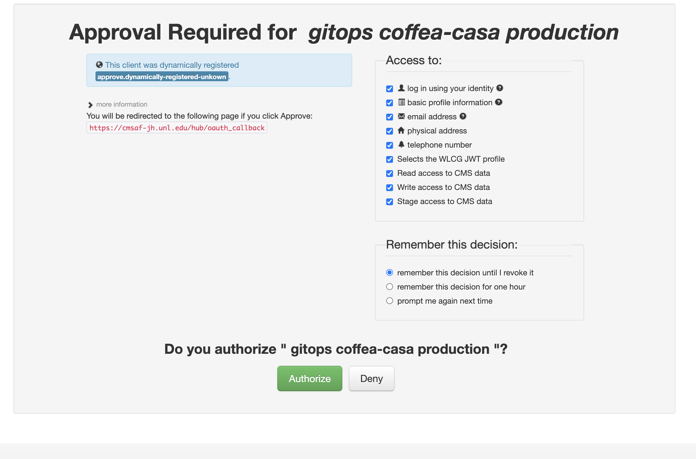
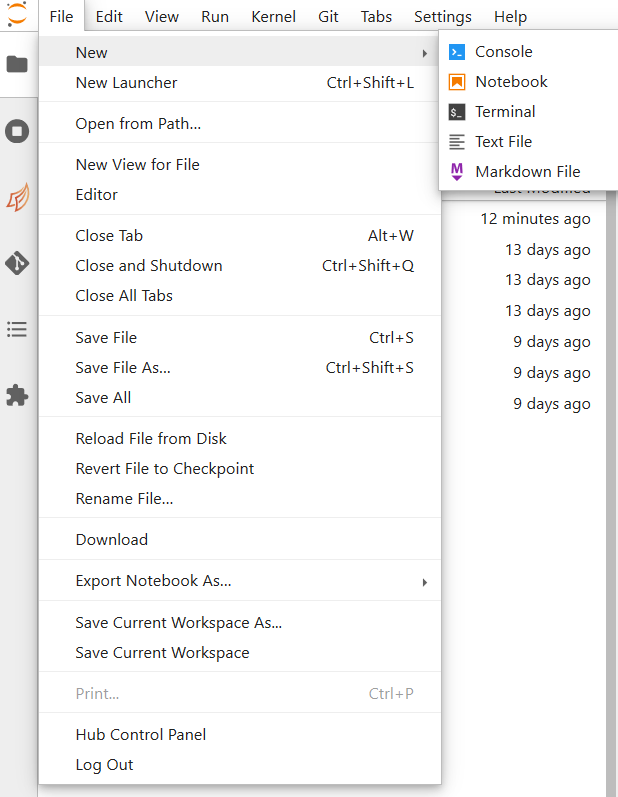
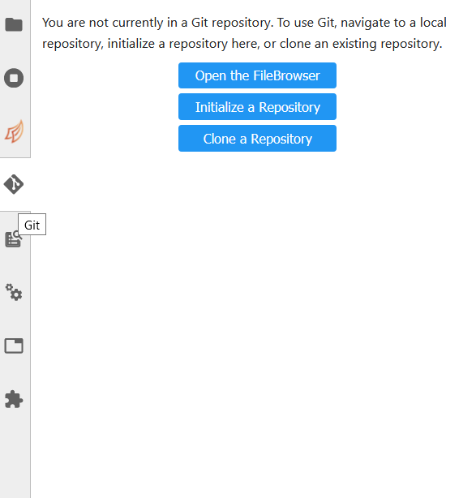

> ## About Coffea Casa
>
> - <a href="#prerequisites">Prerequisites</a>
>
> - <a href="#access">Access</a>
>
> - <a href="#authz">Atlas AuthZ authentication</a> 
>
> - <a href="#docker">Docker</a>
>
> - <a href="#cluster">Cluster resources</a>
>
> - <a href="#open">Open a new console or file</a>
>
> - <a href="#git">Using git</a>
>
{: .callout}

<h2 id="prerequisites">Prerequisites</h2>

 <a href="https://coffeateam.github.io/coffea/examples.html/">documentation</a> 

check this <a href="https://github.com/CoffeaTeam/coffea-casa-tutorials/blob/master/analysis/analysis_tutorial.ipynb">tutorial on columnar analysis in coffea</a>

Are you familiar with Python, Jupyter Notebooks, JupyterLab interface?

Useful tutorials

<a href="https://docs.python.org/3/tutorial/"> python tutorial </a>

<a href="https://jupyter.org/"> jupyter notebook documentation </a>

<a href="https://jupyterlab.readthedocs.io/en/stable/user/interface.html"> JupyterLab interface</a> 

<h2 id="access">Access</h2>

<a href="https://coffea.af.uchicago.edu">access point to the Coffea-Casa Analysis Facility at UChicago</a>

<h2 id="authz">Atlas AuthZ authentication</h2>

 

<h2 id="docker">Docker</h2>

 
 

<h2 id="cluster">Cluster resources</h2>

 
 

<h2 id="open">Open a new console or file</h2>

 

<h2 id="git">Using git</h2>

 
 



