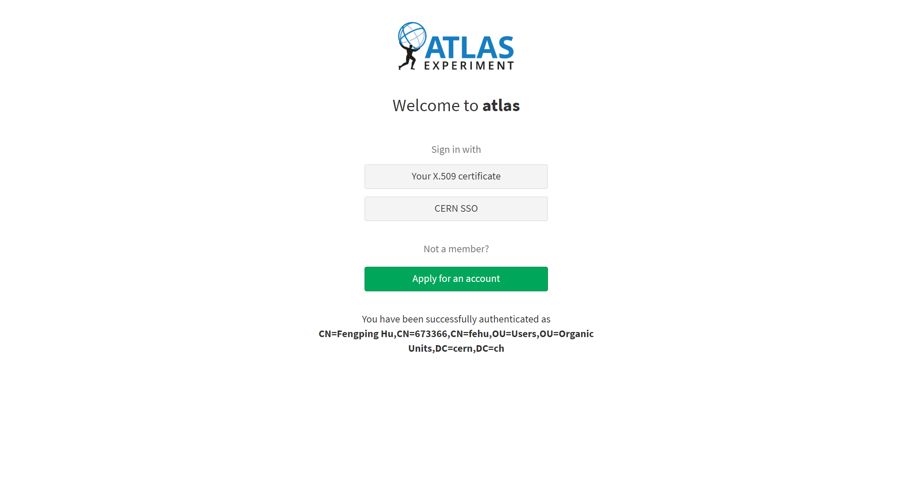
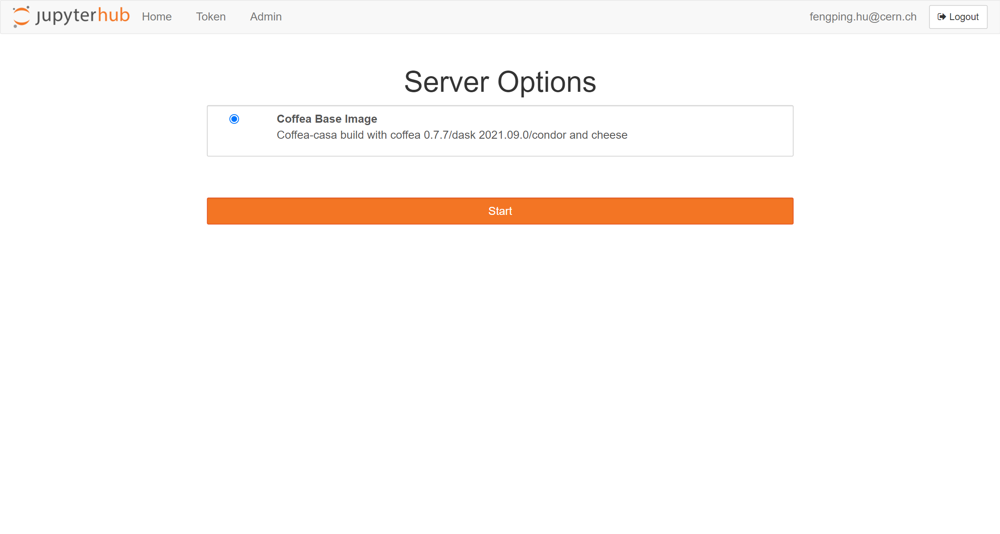

> ## About Coffea Casa
>
> - <a href="#prerequisites">Prerequisites</a>
>
> - <a href="#access">Access</a>
>
> - <a href="#authz">Atlas AuthZ authentication</a> 
>
> - <a href="#docker">Docker</a>
>
> - <a href="#cluster">Cluster resources</a>
>
> - <a href="#open">Open a new console or file</a>
>
> - <a href="#git">Using git</a>
>
{: .callout}

<h2 id="prerequisites">Prerequisites</h2>

<h2 id="access">Access</h2>

<h2 id="authz">Atlas AuthZ authentication</h2>

 

<h2 id="docker">Docker</h2>

 
 

<h2 id="cluster">Cluster resources</h2>

 
 

<h2 id="open">Open a new console or file</h2>

 

<h2 id="git">Using git</h2>

 
 



