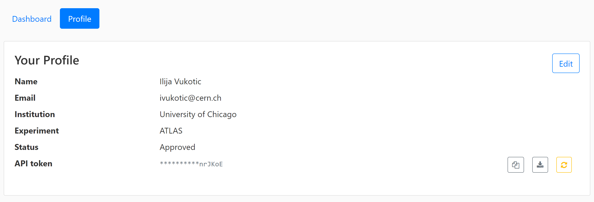

> ## About ServiceX
>
> - <a href="#servicex">ServiceX</a>
>
> - <a href="#columnar">Columnar data analysis with DAOD_PHYSLITE</a>
>
{: .callout}
<h2 id="servicex">ServiceX</h2>

<h2 id="columnar">Columnar data analysis with DAOD_PHYSLITE</h2>


